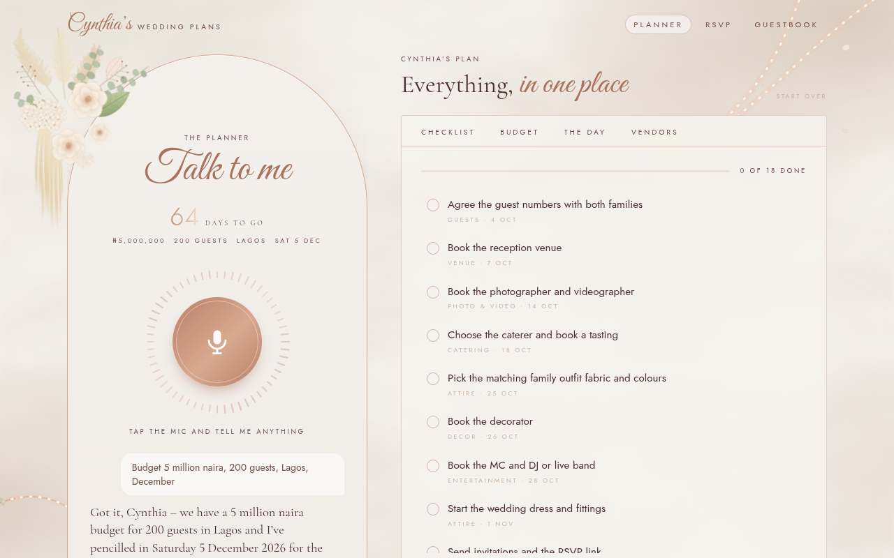
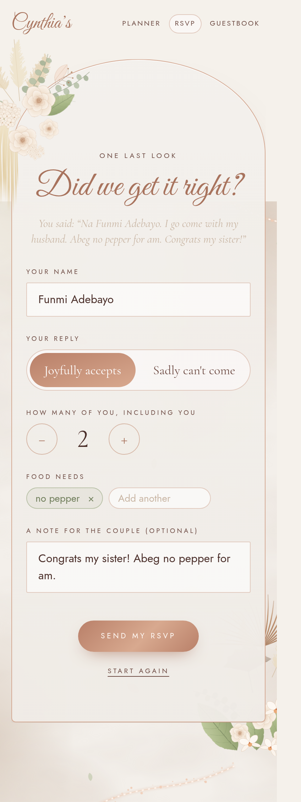

# Cynthia's Wedding Plans

A wedding planner you talk to, built for my friend Cynthia. It also collects voice RSVPs and voice wishes from her guests.

## The problem

Cynthia is getting married in Lagos. She has a budget, about 200 guests and a lot of small decisions:
the venue, the caterer, the matching family outfits, the MC, the head-tie artist, who pays for what, and what's due this week.

The guests are the other half. Her aunties will not fill in a Google Form. RSVPs come in as WhatsApp voice notes,
texts like "I go come, just me" and replies to a status. Nobody has one list, so nobody knows the headcount or who doesn't eat pork.

I wanted something she could just talk to, and something her guests could just talk to.

## What it does

**1. The planner (`/planner`).** Cynthia taps the mic and says *"Budget is 5 million, about 200 guests, Lagos, December."*
It builds the plan: a checklist with due dates that fits the time left, a budget split, the order of the day and a vendor list.
Later she says *"We booked the photographer, Lens by Tobi"* and it ticks the task off and adds the vendor.
It answers out loud. One tap gives a briefing: days left, what's overdue, and the next three things.



**2. Voice RSVP and guest list (`/rsvp`).** A guest opens the link and says *"Na Funmi Adebayo. I go come with my husband. Abeg no add pepper for am."*
It fills in a card: name, coming or not, how many, food needs, and a note. The guest checks it, fixes anything and sends it.
Pidgin and typing both work. Cynthia's private list (`/rsvp/list`, behind a key) shows the headcount, the food needs for the caterer
and every reply, with a CSV download. If someone replies twice, the latest answer counts.



**3. Voice guestbook (`/guestbook`).** Guests record a wish of up to a minute, or write one. Each wish is transcribed and sorted into
blessings, advice, funny ones and memories. The result is a keepsake page with the words and the original voices. Cynthia can hide any wish.

## Why open-source AI

The part that does the planning is an open-weight model. By default it's `gpt-oss-120b` (Apache 2.0) on Groq,
and it falls back to `gpt-oss-20b` if that's slow. Any OpenAI-compatible endpoint works, so swapping the model is one env var.

- **It can run on a laptop.** Point it at Ollama with Gemma and the planning runs with no cloud model at all. I tested it with `gemma3:1b`.
- **Her data stays with her.** RSVPs, wishes and recordings go into storage Cynthia owns: a private Vercel Blob store, or a `.data/` folder on her machine.
  Her plan lives in her own browser. Recordings are served through the app and never as public links.
- **It costs almost nothing.** Each planner message is a small JSON request to a cheap open model. On Groq that works out to a fraction of a cent per message.
- **What's hosted, honestly:** the voice parts use ElevenLabs, so audio goes to ElevenLabs to be transcribed and spoken.
  On the default setup the model runs on Groq's servers. Only the Ollama setup keeps the thinking fully on her machine.
  If no model is reachable, a small rule-based parser still picks up budgets, guest counts, dates and "we booked the venue".

## How ElevenLabs is used

- **Speech-to-text (Scribe, `scribe_v1`)** for all three parts: Cynthia's planner notes, guests' RSVPs and guestbook wishes.
- **Voice Design** for the voice itself. I described a young woman from Lagos with a natural Nigerian English accent, warm and calm, like a best friend helping plan a wedding, and saved it as "Cynthia Planner". The planner should sound like someone from home.
- **Text-to-speech (`eleven_flash_v2_5`)** in that voice for the planner's spoken replies and the daily briefing.
- **A spoken thank-you** for each guest after they RSVP, using their name.
- **The note on the home page, read aloud.** It was generated once with `eleven_multilingual_v2` (`scripts/make-letter-audio.mjs`) and saved as a static mp3, so playing it costs nothing.

The keys stay on the server. The browser only talks to the app's own `/api` routes. The designed voice belongs to my ElevenLabs account, so if you run this with your own key, set `ELEVENLABS_VOICE_ID` to one of your voices.

## Run it yourself

```bash
npm install
cp .env.example .env.local   # fill in the keys below
npm run dev                  # http://localhost:3000
npm run seed                 # optional: sample RSVPs and wishes
```

Run the planning model locally instead of on Groq:

```bash
ollama pull gemma3:4b        # or gemma3:1b on a small machine
LLM_BASE_URL=http://localhost:11434/v1 LLM_MODEL=gemma3:4b npm run dev
```

| Variable | What it's for |
| --- | --- |
| `ELEVENLABS_API_KEY` | Speech-to-text and text-to-speech. |
| `LLM_API_KEY` or `GROQ_API_KEY` | The model endpoint. Not needed for Ollama. |
| `LLM_BASE_URL`, `LLM_MODEL` | Optional. Defaults to Groq and `openai/gpt-oss-120b`. |
| `RSVP_HOST_KEY` | Cynthia's key for the guest list, the CSV and hiding wishes. Open locally if unset, locked on Vercel if unset. |
| `BLOB_READ_WRITE_TOKEN` | A private Vercel Blob store for deployed data. Without it, data goes in `./.data`. |

Built with Next.js, Tailwind and Framer Motion. The flowers are hand-drawn SVG, and the look follows a save-the-date card Cynthia liked.
End-to-end tests are in `scripts/` and need `playwright-core` and Chrome.

## Why I built it

I built this for the DEV Hacktoberfest 2026 Weekend Challenge, "Build for a Friend".

Cynthia, I hope this gives you one less thing to worry about. Congratulations. — Kane
